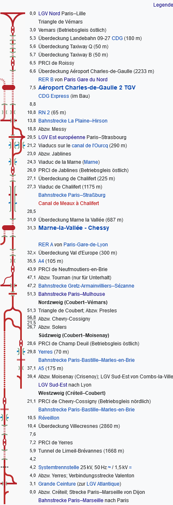

# TrainCompany-Tools
First, you should clone the repository with submodules in order to be able to use all available data; it should also be cloned to the `tools`-directory inside `TrainCompany-Data`:
```
git clone --recurse-submodules https://github.com/c1710/TrainCompany-tools tools
```
To use the tools, you will need to have Python 3.9 (other versions may be compatible) and install the requirements first:
```
python -m pip install -r requirements.txt
```
**Note:** The command might be `python3` instead.
Further, it may be possible that `pyproj 3.3.1` is not available as a precompiled library (e.g., on Mac devices with an M1 processor).
In that case you may want to try to edit `requirements.txt` and replace the line `pyproj~=3.3.0` with `pyproj==3.3.0`.

Once the requirements are installed, you can use all these tools.
**Note**: All examples here assume that you are in the (parent) TrainCompany-Data directory and that the scripts are within `tools`.

There are currently the following tools available. The most important ones will be explained in their own sections.
To see all command line parameters, you can always use the `-h` or `--help` option.
- `cleanup.py`: Removes annotations from `Path.json`
- `convert_coordinates`: Converts the given coordinates (latitude, longitude) to the TrainCompany format, including projection.
- `create_tasks.py`: Creates a new task entry (only Ausschreibungen).
- `export_station_list.py`: Exports all known stations of a country to a file.
- `fix_positions.py`: _Not supported anymore_
- `import_stations.py`: Adds all given stations to `Station.json`.
- `import_trassenfinder.py`: Imports a trassenfinder.de CSV export into the game files (or similar files).
- `plot.py`: Renders a map of the currently available stations and paths to `map_plot.svg`.
- `project_coordinates.py`: Transforms _all_ coordinates of all stations to the given projection version.
- `shift_station_coordinates.py`: _Should usually not be needed._
- `update_path_suggestions.py`: _Please do not use this scripts as it will replace all `pathSuggestion`s for all tasks._
- `validate_files.py`: Checks the files for possible issues.

## Station lists
The `import_stations.py` and `create_tasks.py` both need you to type in many stations. To make it easier for countries other than Germany, it has some convenience features:
Instead of a flag, you can use the ISO 3166 country code with a colon. E.g., instead of typing `🇫🇷LDO`, you can simply type `FR:LDO`.
Additionally, you can "fix" the country prefix for the following codes by typing the colon-prefix without a station.
Example: `FR: LOI LDO ...` is equivalent to typing `FR:LOI FR:LDO`.
If you have the country explicitly in the code (e.g., as a RIL100 prefix like `XFBRT` or with other formats `FR:LFO`),
these will override the "current" country for this single code.
To reset the prefix, you can use `:`.
Full UIC codes will also be converted to the flag + partial UIC code format.
A longer example:
```
FR: XFCZ XFAI CSK AEB XFEI XFSAC XFJMA IT: 8300205 XITU
```

With the `import_stations`-tool, you can set two station codes as equivalent with `=`.
For example, there are two entries for Orléans main station:
```tsv
Orleans	XFOL
Orléans Centre	🇫🇷ORL - 🇫🇷54300 - 8754300
```
We now want to use data from both entries (i.e., the RIL100 code of the first entry and the platform data of the latter one).
In that case we can write `XFOL=FR:ORL` to indicate that both of them are the same station.

## The tools
### `create_tasks.py`
With this tool, you can easily create new tasks with default descriptions and `pathSuggestion`s.
You can specify multiple sub-tasks with the same description, etc. by using the `--stations` option multiple times.
The format is simple: The first argument is the kind of train you want to add (e.g., `RE`).
You can optionally specify a name (which then requires an article) of the service.
Then you add one or more `--stations` lists.
Example: `python tools/create_tasks.py TER --stations XFR XFLAM XFSBC FR: MXR LDI LDO XFBRT`

### `export_station_list.py`
With this tool, you can easily get a list of all available stations of a country with the appropriate codes.
You can use it by calling `python tools/export_station_list.py <ISO-Code>`, with `<ISO-Code>` being an ISO 3166 2-character country code,
e.g., `FR`.
It will then output a file like `stations_FR.tsv`.
It will contain station names and the available codes, in the order in which they can be used.
Please note, that for many stations you will find multiple entries, e.g., with different spelling, etc.
In these cases, the toolset did not recognize that these are the same stations; usually there is one entry with a flag-code and/or UIC-code
(e.g., `🇫🇷BRT`) and one with a RIL100 code (e.g., `XFBRT`).
`import_stations.py` now has a way to use data from both entries. It is described in the section "Station lists".

### `import_stations.py`
With this tool, you can add new stations to the files.
You can use it with `python tools/import_stations.py --stations ` and then a space-separated list of the station codes you want to add.
When you want to add new routes, especially outside of Germany, you may want to use the `--trassenfinder` option.
It will create a trassenfinder-like file with all the stations you added (in that order).
In this file, you can then easily enter the distances from the start station to later import the new path.
If you try to add a station that already exists (or at least its code/RIL100 is already in the game), it will ignore it.
This is especially useful with the `--trassenfinder` option as you can start the route at an existing station.

You can also use the `--gpx` option to create a GPX-file which you can import e.g., in brouter.
#### Imported data
It will import the station name, code/RIL100, and (if available) location and platform data.
The group will be automatically deduced from the available data.
You will especially need to check the group and platform count as these tend to be inaccurate.

### `import_trassenfinder.py`
This tool reads a CSV export from trassenfinder.de.
It adds all waypoints that have been marked as `"Kundenhalt"` (on the website you will need to add a stop time of 2 or more minutes).
It then uses the segment lengths to create a path (it will _not_ regard existing paths, only existing stations).
A useful option is `--annotate`, which will add the full station names to the path segments.
This makes it easier to identify the segments on OpenRailWayMap, for example.
Please note that you will need to remove them afterwards (e.g., with `cleanup.py`) to avoid test fails.
#### Imported data
It will import the station data (cf. `import_stations.py`) and the path waypoints and segment lengths.
If possible, it will also import data on electrification and the group of the line.
It will _not_ import vMax and twistingFactor.

### `plot.py`
A simple tool to render a map. It does not take command line arguments and it does not offer an `-h` option, as it is still one of the old scripts.
It is very useful to find mistakes and cluttered regions. As a rule of thumb, the points of two stations should only overlap a little.

The resulting SVG file can be opened with InkScape or possibly a web browser.

### `validate_files.py`
Goes through the files and detects possible issues like stations that are not connected to the main network, too long segments, etc.
Not all of these issues are really significant, it may even be wrong.
However, a sufficiently high score will fail the script (and later the checks for your Pull Request).
For each issue it finds it displays how much this issue increased the counter.
Usually, it will be very large issues that cause a fail (those that increase the counter by 10000 or similar).
For example, if you forgot to remove the annotations from `Path.json` with `cleanup.py`, the issue counter will be very large.
If there are only small issues and the validation fails, it may be okay, especially if it was close to the threshold (currently `700`) before.

## Workflow to add a new international route
This is an example on how you can create a new route outside of Germany with the help of these tools.
**Outdated: `import_brouter` may be a better choice. An explanation can be found in `README_DE.md`**

### 1. Which route and which stations?
First, you need to know, what route you want to add.
A good source for this is Wikipedia. There you can search for the route or relevant stations.
As an example, we will look at the LGV Interconnexion Est:
https://de.wikipedia.org/wiki/LGV_Interconnexion_Est

On Wikipedia, you can usually find a schematic representation of the route:

(CC-BY-SA-3.0 Wikipedia – Die freie Enzyklopädie)

You should add all stations that are in bold, as these are the most important ones.
For the other stations (red, filled dots or similar shapes), you will need to decide whether it makes sense to include them.
Usually you should make sure that the distance between two stations is not longer than 30 km (on a non-high speed line, at least).
However, it should not be too short either.
The overview usually shows you the running kilometers next to the station names, which you can use as a guide.
Then you can also check the Wikipedia articles (or tooltips) on how large the towns or cities belonging to the stations are.

### 2. Importing the stations
You can look in the relevant station list(s), which you can export with `export_stations.py`,
which the correct codes for the stations you want to include are.
Please note that you should always prefer RIL100 codes if there are any (and then local codes and only then UIC numeric codes).
Further, you should try to search for different spellings, etc., in case the datasets are not correctly  merged for a station.

Another tip: If you need to add a junction, etc., you may consider reusing a nearby station.
For example, many LGV stations are essentially "merged" with their classic counterparts.

You can then import the codes using the `import_stations.py`-script.
Please make sure that you use the `--trassenfinder` option (or re-run it later with it).
Example:
```
python tools/import_stations.py --trassenfinder --stations FR: MOIS XFMVC XFVAR CDG VEMARS
```
This would import the stations we need for the LGV Interconnexion Est:
- Moisenay
- Marne-la-Vallée-Chessy (manually added the "D'land Paris" part)
- Vaires-Torcy (merged with the nearby connection to the LGV Est-Européenne)
- Airport CDG Terminal 2
- Vémars

Note: Moisenay and Vémars do not actually exist in any of the datasets and have been hard-coded into the tool manually, which is out of scope here.

### 3. Correcting mistakes, adding missing station data
When running the script, you will probably see some warnings that it could not find the platform data for a station.
In these cases, you will need to find them in the `Station.json` file and add the platform data manually.
For this, you can use Google Maps or Open Street Maps (e.g., with the links the script provides) and measure/count yourself.
For example, Google Maps has a measurement tool if you right-click at a point.
Of course, you do not need to add platform data for non-passenger stations.

It may also be possible that you need to manually add location data.
For this, you can also use a maps service. For example, on Google Maps, you can right-click at a location and click on the coordinates to copy them to your clipboard.
You can then use `convert_coordinates.py` like this (the comma will be ignored):
```
python tools/convert_coordinates.py 48.87073962503786, 2.7827819862322647
```
and it will output the `x` and `y` coordinates, which you can then add to the station's entry.
If you use these values, please make sure that you add `"proj": 1`, as the location data is already in the correct projection.

Otherwise, you can fix misspelled names, groups, etc.
YOu may also want to look at the rendered map with `plot.py`.
With its help you can adjust coordinates manually and remove (or add) some stations, if it is too dense or if there are too long segments.
Please make sure that you also reflect these changes in your trassenfinder-like file.
Otherwise it may re-add stations or skip some.

### 4. Getting path lengths and importing the paths
For this part, I highly recommend a tool like brouter.de/brouter-web.
In the top left, you can select "Eisenbahn, Original" to track railways.

You can then open both brouter and the generated Trassenfinder-file (named after the first and last waypoint) side by side and start adding data.
In brouter, you can look up the stations (e.g., with the search function and the names from the file or by following the rail tracks) and click on them.
In the bottom left, the distance will increase. You will need to add these values in the first empty quotes of the line for your current station in the file.

Once you have all the distances (from the start) collected, you can import the file:
```
python tools/import_trassenfinder.py --annotate 🇫🇷MOIS-🇫🇷VEMARS.csv
```
Note that it will output a lot of warnings about missing data on electrification, etc.; you can safely ignore that.
It may also output more warnings about missing platform data, you can ignore that as well.

### 5. Adding vMax, twisting factor and more path data
When you look at the newly created path in `Path.json`, you will first notice that `group` is set to `-1`.
You will need to insert `0`, `1` or `2` here.
You will probably also need to adjust the electrification.
Then you will need to consider `maxSpeed` and `twistingFactor`.
By default, they are in the "root" path entry, which may work if many segments share the same twistingFactor or maxSpeed.
It will also include the required countries automatically.
However, you may need to add/remove equipments here.

For data on the twistingFactor and maxSpeed, you can look at openrailwaymap.org.
There you may want to enable the colorful "Mapnik" layer, on which it is a bit easier to find the stations.
With the help of the annotations, you can identify the stations and then look at the track segments to determine maxSpeed and twistingFactor.

### 6. Cleanup, checking
When you added all the remaining information, you should be ready.
But first, you should do three things:
1. Remove the annotations by using the `cleanup.py` tool.
2. Check if there are no big issues with `validate_files.py`
3. Check the map with `plot.py`

If everything works correctly, you are done.


# Data Licenses
cf. `data/README.md`
